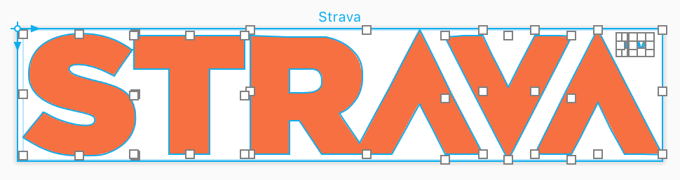

# PaintCode

[PaintCode](https://www.paintcodeapp.com) is an image editor which generates code in Objective-C or Swift which can be used in an Xcode project to create images on demand. By using PaintCode it is not necessary to manage a large collection of image asset catalogs.

PaintCode can import assets from Sketch as well as SVG documents.

