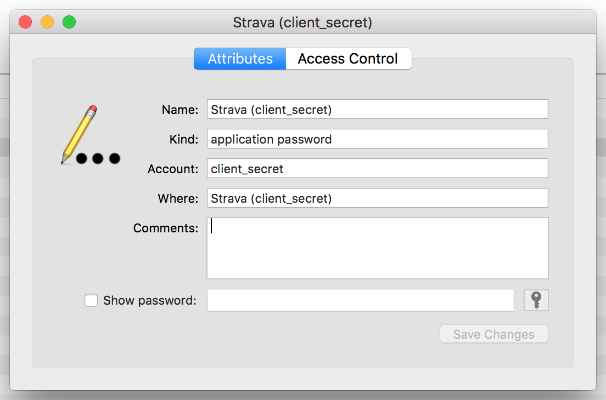
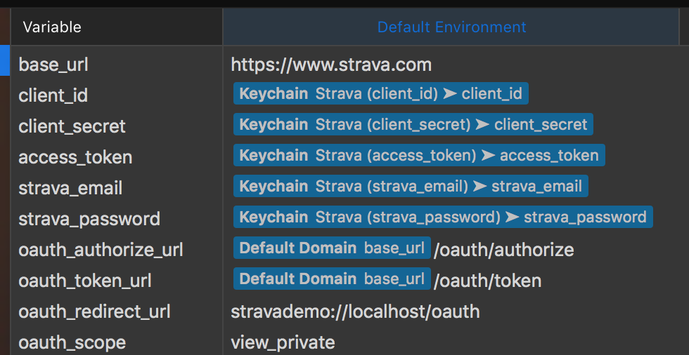
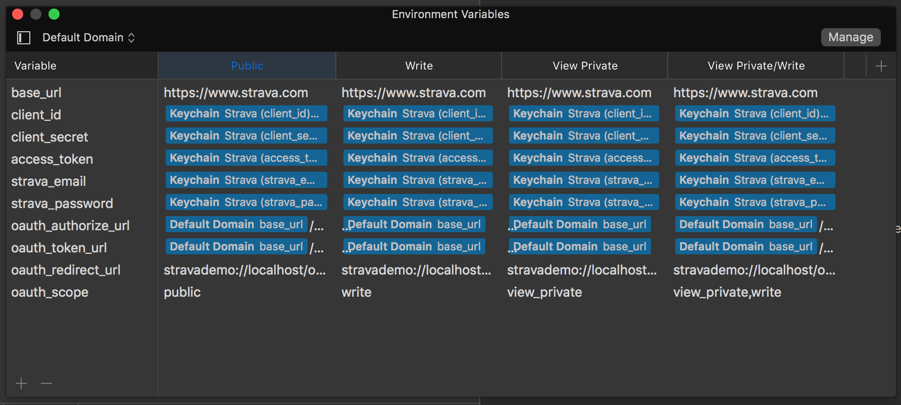

# Paw

[Paw](https://paw.cloud) is a powerful REST client which allows for creating calls to endpoints with support for OAuth and secure storage of credentials.

In the Paw document for Strava the credentials used for OAuth are stored in the Keychain. These values can be set in the Keychain as shown in the screenshot below. The `Name` and `Account` fields must match what is in the Paw document for the environment variables which are used for each of the calls to the API endpoints.

Paw supports a serioes of Environment Variables which make each of the requests configurable for common variables. One key difference for an API is the is the scope used for OAuth. For Strava there are 4 different scopes and each is configured in the Paw document.

